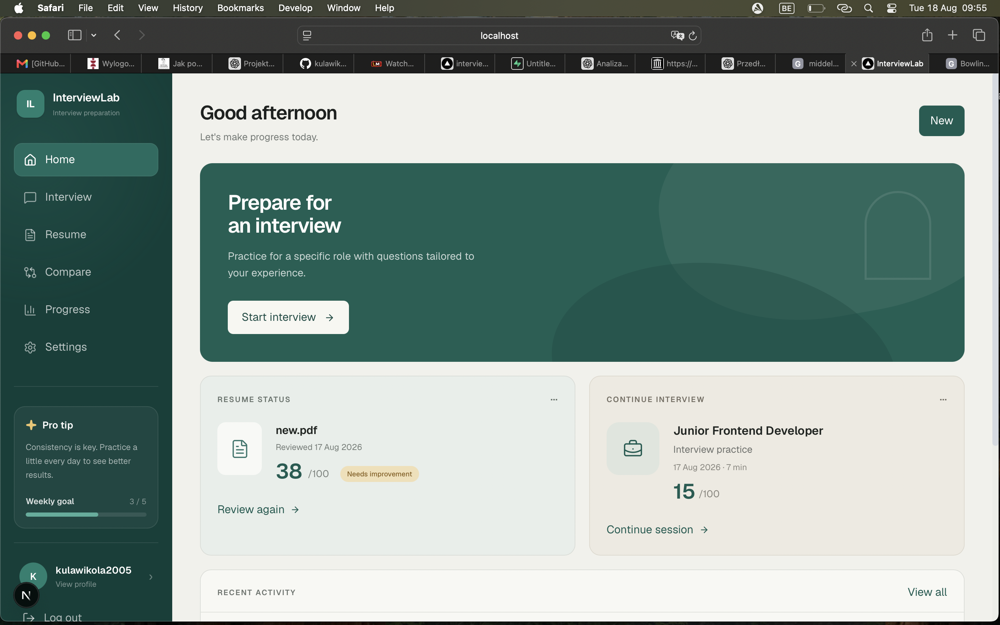
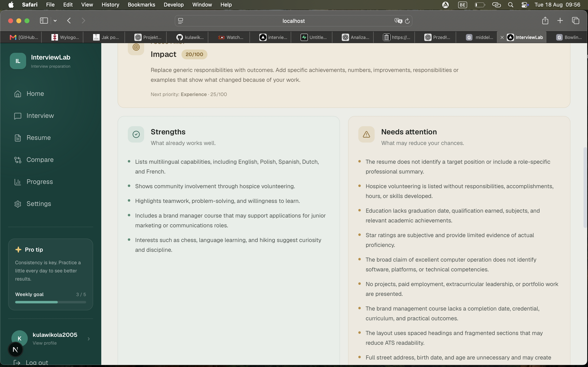
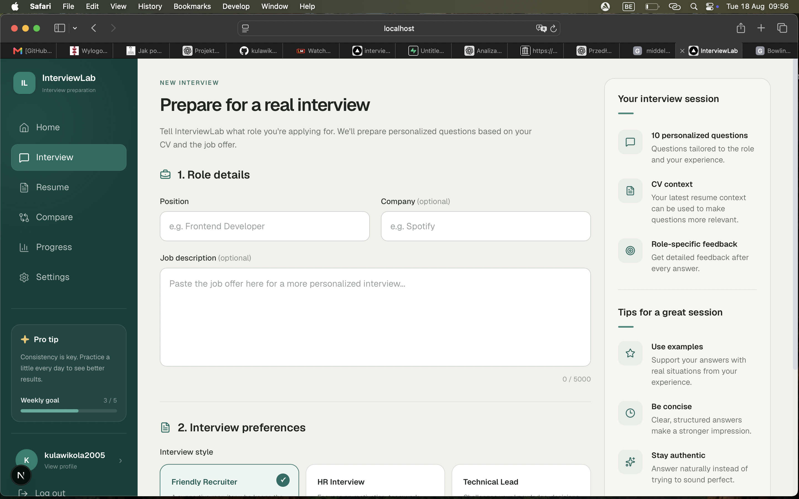
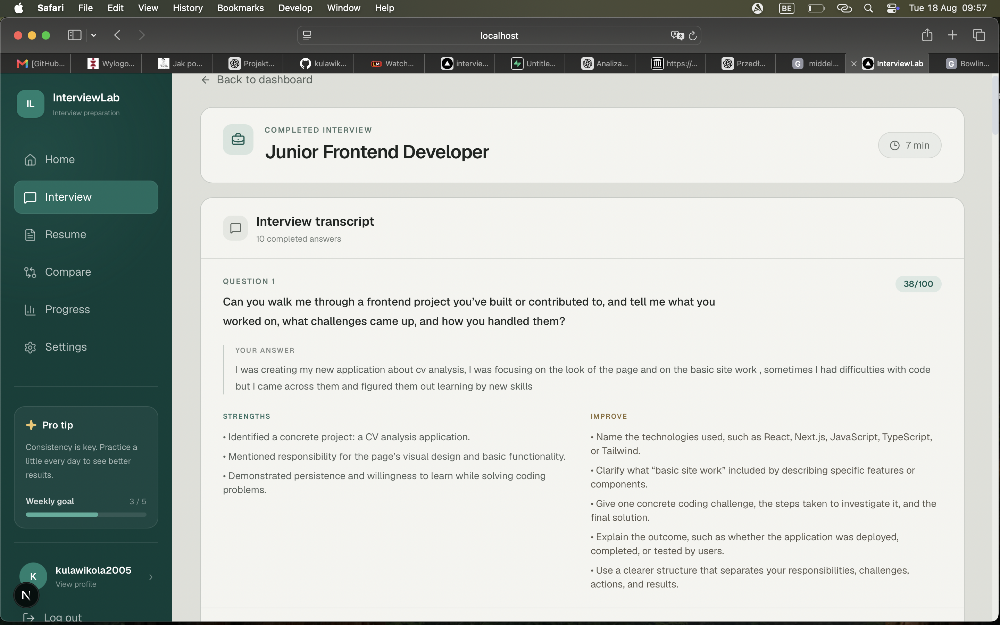
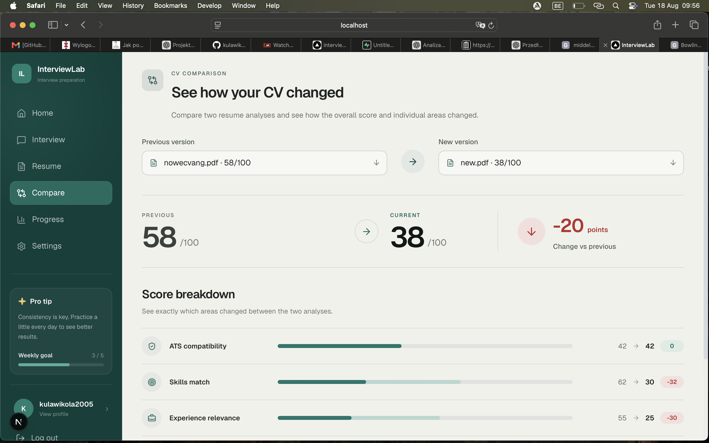
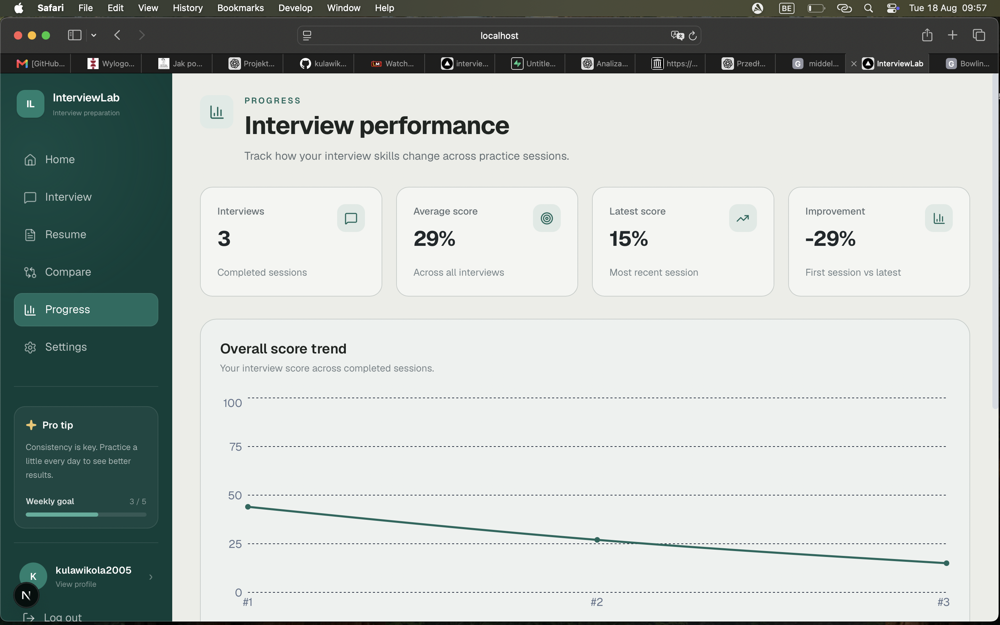

# InterviewLab

AI-powered interview preparation platform that helps users improve their resumes, practice personalized job interviews, receive structured feedback, and track their progress over time.

InterviewLab combines resume analysis with interactive interview simulations to create practice sessions based on the user's experience, target position, job description, and preferred interview style.

## Live Demo

https://interviewlab-rho.vercel.app

## Product Preview

### Dashboard & Resume Analysis

<table>
  <tr>
    <td width="50%">
      
    </td>
    <td width="50%">
      
    </td>
  </tr>
</table>

### Interview Practice & Feedback

<table>
  <tr>
    <td width="50%">
      
    </td>
    <td width="50%">
      
    </td>
  </tr>
</table>

### Resume Comparison & Progress

<table>
  <tr>
    <td width="50%">
      
    </td>
    <td width="50%">
      
    </td>
  </tr>
</table>

## Key Features

### Resume Analysis

Upload a PDF resume and receive a structured analysis including:

- Overall resume score
- ATS compatibility
- Skills match
- Experience relevance
- Impact
- Formatting quality
- Strengths and weaknesses
- Prioritized improvements
- Interview questions based on the resume

Analyses can be saved and revisited later.

### Resume Comparison

Compare previous resume analyses to understand how changes to your CV affect individual metrics and the overall score.

### Personalized Mock Interviews

Create an interview session based on:

- Target position
- Company
- Job description
- Resume context
- Preferred interview style

Available interview styles include friendly, HR, technical, startup, and stress interviews.

### AI Answer Evaluation

During an interview, answers are evaluated to provide structured feedback and help users improve the quality of their responses.

### Final Interview Report

Completed interviews generate a report containing:

- Overall performance score
- Interview metrics
- Strongest areas
- Areas to improve
- Hiring recommendation
- Hiring reasoning
- Suggested next steps

### Progress Tracking

InterviewLab stores completed sessions and visualizes performance over time, helping users identify their weakest interview skills and prioritize future practice.

### Authentication & Personal Data

Users can create an account, sign in, reset their password, and access their own resume analyses and interview history.

Database access is protected using Supabase Row Level Security.

## Tech Stack

### Frontend

- Next.js
- React
- TypeScript
- Tailwind CSS
- Lucide React

### Backend & Data

- Next.js Server Actions
- Supabase
- PostgreSQL
- Supabase Authentication
- Row Level Security

### AI

- OpenAI API
- Structured resume analysis
- Dynamic interview question generation
- Answer evaluation
- Final interview report generation

### Deployment

- Vercel
- GitHub

## How It Works

1. A user creates an account or signs in.
2. The user uploads a PDF resume.
3. InterviewLab analyzes the resume and generates structured feedback.
4. The analysis can be stored in the user's history.
5. The user creates a mock interview for a selected role.
6. Interview questions are generated dynamically using the provided context.
7. Answers are evaluated throughout the interview.
8. A final report summarizes performance and improvement areas.
9. Completed sessions contribute to the user's progress dashboard.

## Security

InterviewLab uses several measures to keep application data and credentials separated from the client:

- Supabase authentication for user sessions
- Row Level Security policies for user-owned database records
- Server-side OpenAI API calls
- Environment variables for API credentials
- User-specific resume and interview data access
- Server-side authentication checks

API keys and environment files are not committed to the repository.

## Database

The application currently stores two primary types of user data:

### Resume Analyses

Stores resume scores, analysis metrics, strengths, weaknesses, recommendations, interview questions, and optional job-description context.

### Interview Sessions

Stores interview configuration, conversation turns, performance metrics, final reports, hiring recommendations, and session duration.

Both are associated with the authenticated user.

## Running Locally

Clone the repository:

```bash
git clone https://github.com/kulawikola2005-a11y/interviewlab.git
cd interviewlab
